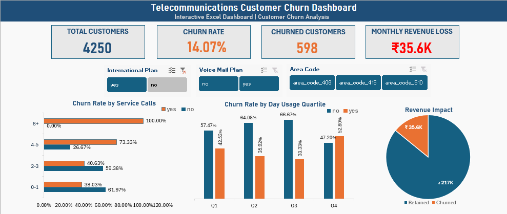

# Telecommunications Customer Churn Analysis

## Project Overview

This project analyzes customer churn in a telecommunications company using Microsoft Excel. The objective is to identify the factors influencing customer churn, measure its business impact, and present the findings through an interactive dashboard.

The analysis includes customer behavior, service usage, customer support interactions, and revenue impact to provide actionable business insights.

---

## Dashboard Preview



---

## Objectives

- Analyze customer churn patterns.
- Identify key factors influencing churn.
- Identify high-risk customer segments.
- Measure the financial impact of customer churn.
- Build an interactive Excel dashboard for business decision-making.

---

## Dataset

The project uses the following datasets:

- train.csv
- test.csv
- sampleSubmission.csv

---

## Tools Used

- Microsoft Excel
- Pivot Tables
- Pivot Charts
- Slicers
- Excel Functions
- Conditional Formatting

---

## Project Structure

```text
TELECOMMUNICATIONS_CHURN_ANALYSIS
│
├── analysis
│   └── Insights.md
│
├── data
│   ├── raw
│   │   ├── train.csv
│   │   ├── test.csv
│   │   └── sampleSubmission.csv
│   │
│   └── processed
│       └── telecommunications_churn_analysis.xlsx
│
├── reports
│
├── screenshots
│   └── dashboard.png
│
├── README.md
└── .gitignore
```

---

## Analysis Performed

### Basic Analysis

- Customer churn distribution
- Account length analysis
- International plan analysis
- Customer service calls analysis
- Call charges analysis
- Day, evening, and international usage analysis

### Medium Analysis

- Area code segmentation
- Customer service call threshold analysis
- Account length quartile analysis
- International charge segmentation
- Evening usage analysis
- Customer usage segmentation
- Voice mail usage analysis
- Day usage quartile analysis
- International plan vs international calls
- Customer service data availability assessment

### Advanced Analysis

- Customer attribute interaction analysis
- Economic impact of customer churn

---

## Dashboard Features

The interactive dashboard includes:

### KPI Cards

- Total Customers
- Churn Rate
- Churned Customers
- Monthly Revenue Loss

### Interactive Slicers

- International Plan
- Voice Mail Plan
- Area Code

### Visualizations

- Churn Rate by Customer Service Calls
- Churn Rate by Day Usage Quartile
- Revenue Impact Analysis

---

## Key Findings

- Overall customer churn rate is **14.07%**.
- Customers making **4 or more customer service calls** exhibit a significantly higher churn rate.
- Customers in the highest **day usage quartile** have the highest churn rate.
- International Plan subscribers have substantially higher churn than non-subscribers.
- Customer churn results in an estimated monthly revenue loss of approximately **₹35.6K**.

---

## Repository

### analysis/

Contains the complete business insights, findings, recommendations, and conclusions from the analysis.

### data/raw/

Contains the original datasets.

### data/processed/

Contains the completed Excel analysis workbook.

### reports/

Contains the final project report.

### screenshots/

Contains the dashboard preview used in this repository.

---

## Author

**Eishu Tamori**